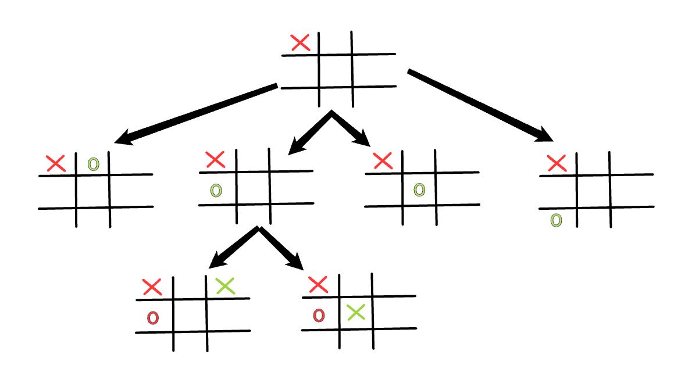
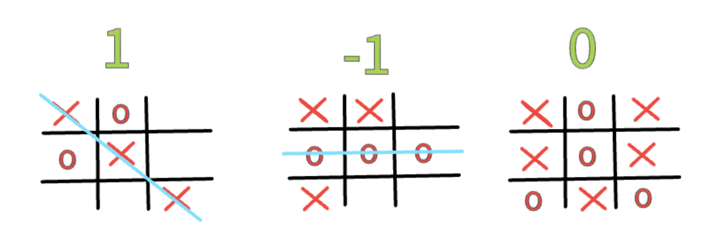

# AI using a MINMAX algorithm

-   Works assuming the other player will play optimally

# Minimax Algorithm Explanation

The following image illustrates the logic behind the Minimax algorithm. The AI evaluates potential moves by simulating the game tree and predicting the best possible outcome, assuming both players play optimally. The goal of the AI is to maximize its score while minimizing the opponent's score. Each node in the tree represents a game state, and the AI chooses the move that leads to the most favorable outcome.

# Value of Each State

The following image illustrates the points each game state receives. If the state is terminal (meaning the game is over, either with a win, loss, or draw), it has a fixed value. However, if the state is not terminal (the game is still ongoing), the value of that state represents the best possible outcome based on all the potential future states from that point onwards. The value is calculated by considering the best achievable result assuming optimal play from both sides.

You can view the function responsible for determining these values in the code file [GameTree.cpp](GameTree.cpp), specifically in the function called `find_best_reachable_state()`.

# Limitations of the Current Minimax Implementation

Although the Minimax algorithm is implemented and functional in this project, it is **not fully optimized**. The primary goal was to test and develop the game logic rather than focus on advanced optimization techniques. As a result, the current implementation lacks several enhancements that could significantly improve its performance and decision-making:

1. **Heuristic Evaluations**: The algorithm does not use heuristic evaluations for non-terminal states, which could allow it to make quicker, more informed decisions without fully traversing the game tree.
2. **Pruning Techniques**: Advanced methods like Alpha-Beta Pruning, which would reduce the number of nodes evaluated, are not implemented. This leads to unnecessary computations, especially in deeper or more complex game states.
3. **Performance Optimization**: The current focus was on correctness rather than efficiency. More sophisticated approaches could include caching results, improving state evaluation functions, and integrating domain-specific knowledge to speed up the decision-making process.

